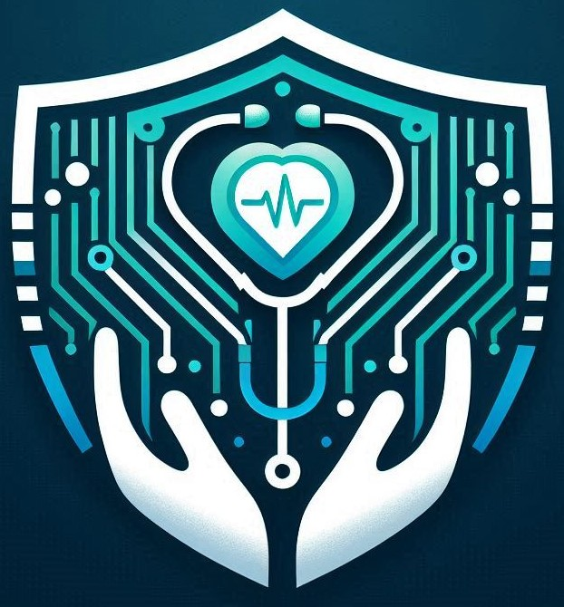
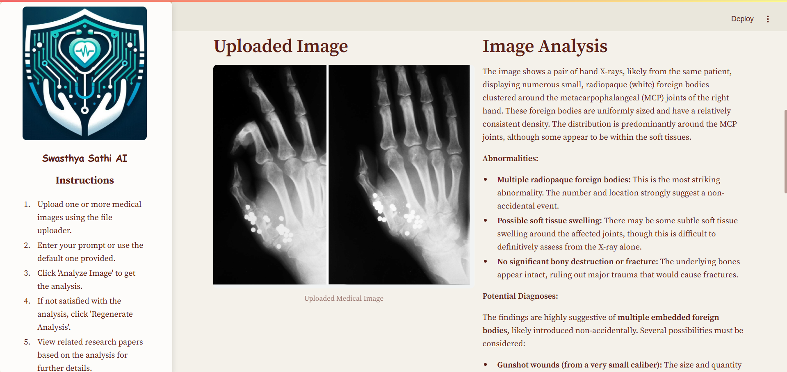
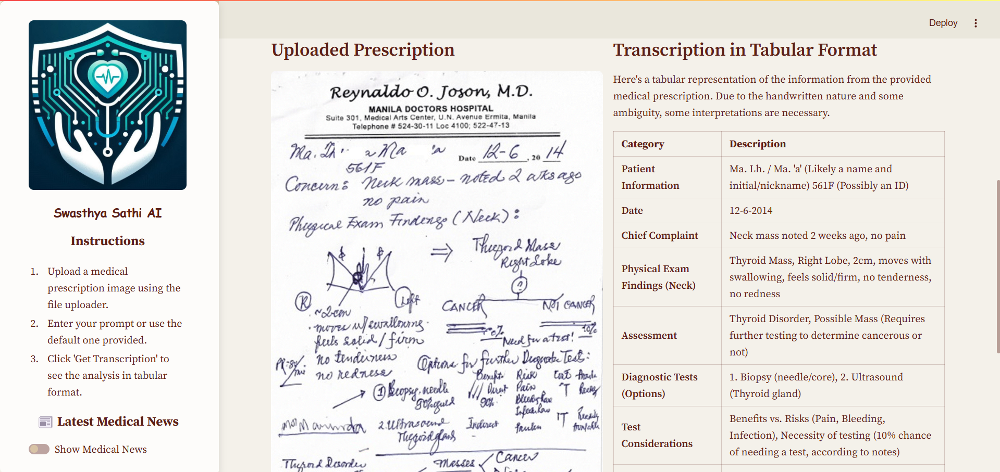
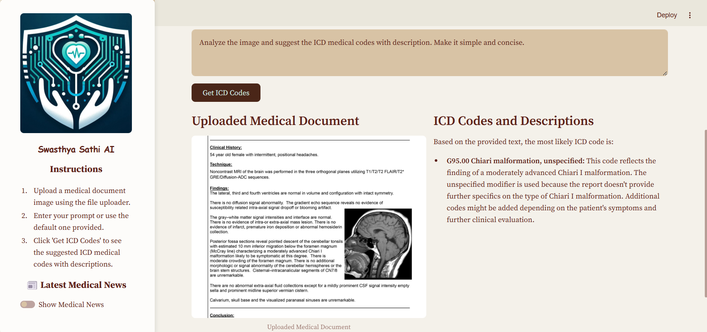
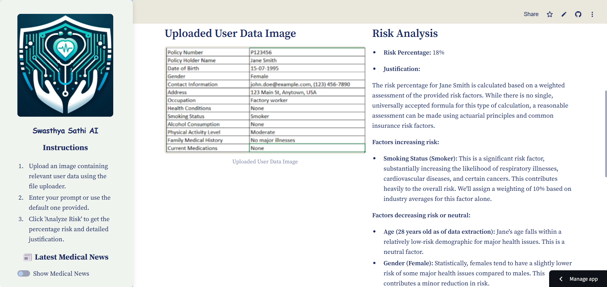
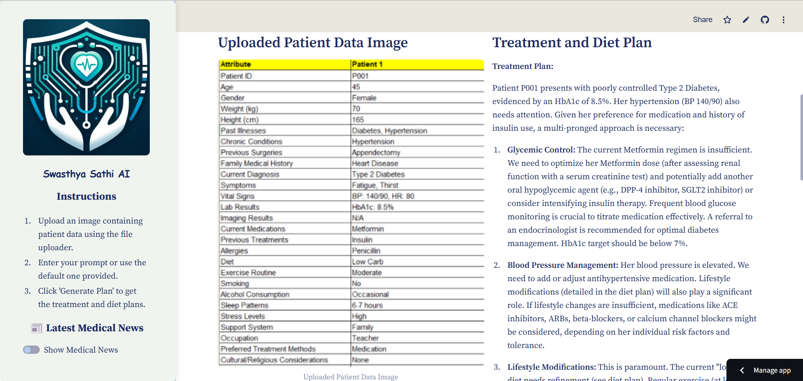
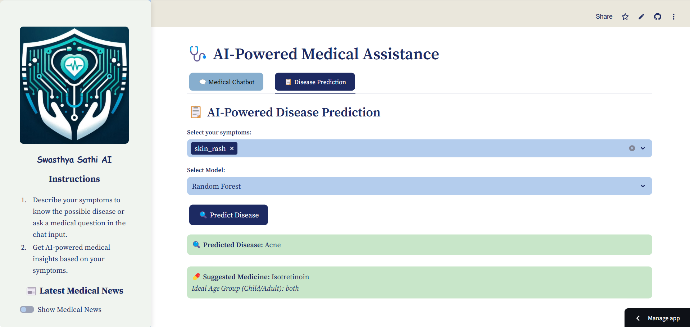

# Swasthya Sathi AI: Smart Medical Diagnosis & Assistance Platform

Welcome to **Swasthya Sathi AI**, a cutting-edge AI-powered medical assistant designed to streamline medical diagnostics, transcription, pathology analysis, and more. This project aims to enhance the efficiency of healthcare professionals by leveraging artificial intelligence for accurate and fast medical assessments.

<p align="center">
  
</p>

> *Experience the AI-powered medical diagnostics and assistance tool in action!*  

## Live Demo  
Want to try it yourself? Click the link below:  
🔗 [Try Swasthya Sathi AI](https://swasthya-sathi-ai.streamlit.app/)  

## Key Features
Swasthya Sathi AI consists of multiple features, each addressing a key aspect of medical diagnostics:

1. **AI-Assisted Images Analysis** – AI-based analysis of medical images, including a Skin Disease Image Classification Model for detecting and classifying skin conditions using deep learning.
2. **Smart Prescription Generator** – Converts medical prescriptions into structured text in tabular format.
3. **AI-Powered Lab Report Analyzer** – Analyzes pathology reports for insights and layman to understand.
4. **AI Medical Coding** – Suggests ICD medical codes based on medical data.
5. **Health Risk & Insurance Evaluator** – Evaluates insurance risk based on patient data.
6. **Personalized Treatment & Diet Planner** – Generates AI-suggested treatment and diet plans based on given information.
7. **AI-Powered Medical Assistance** – Provides medical guidance and symptom analysis, including a Symptom-Disease-Drug Detection ML Model that predicts diseases based on symptoms and suggests appropriate medications.

---

## Installation and Setup

### **1️⃣ Clone the Repository**
```sh
  git clone https://github.com/KrishitaGarg/Swasthya-Sathi-AI.git
```

### **2️⃣ Install Dependencies**
```sh
  pip install -r requirements.txt
```

### **3️⃣ Set Up Environment Variables**
Create a `.env` file in the root directory and add the following variables:
```env
GOOGLE_API_KEY=your_google_api_key
```  

### **4️⃣ Run the Application**
```sh
  streamlit run app.py
```

---

## Module Breakdown  

### 1️⃣ **AI-Assisted Image Analysis**  
📸 Upload medical related images like X-rays and get AI-driven insights, including abnormality detection and diagnostic suggestions, including skin abnormality detection and diagnostic suggestions using advanced machine learning models.  



---

### 2️⃣ **Smart Medical Transcriber**  
📝 Converts medical prescriptions into structured text in a tabular format for better readability and organization.  



---

### 3️⃣ **AI-Powered Lab Report Analyzer**  
🔬 Upload pathology reports and get AI-driven insights in an easy-to-understand format for both professionals and patients.  


---

### 4️⃣ **AI Medical Coding**  
🏥 Automatically suggests **ICD medical codes** with descriptions based on medical data, streamlining coding for healthcare professionals.  



---

### 5️⃣ **Health Risk & Insurance Evaluator**  
📉 Assesses patient data and calculates **insurance risk** percentages with AI-based justifications.  



---

### 6️⃣ **Personalized Treatment & Diet Planner**
🎯 Generates AI-suggested **treatment** and **diet plans** based on patient medical history and symptoms.  



---

### 7️⃣ **AI-Powered Medical Assistance**  
🤖 A smart chatbot for **symptom analysis, medical guidance, and answering healthcare-related queries**.  


🔬 **Disease Prediction Model** predicts potential diseases and suggests medicines based on **user-provided symptoms** using a trained ML model.  



---

## Additional Features

✅ **Different Downloadable PDF Formats** – Generate reports in various formats tailored for different models.  
✅ **Customizable Prompts** – Modify AI prompts for personalized outputs.  
✅ **User-Friendly UI** – Simple and intuitive interface for medical professionals.  
✅ **Latest Medical News Updates** – Stay informed with real-time medical news directly on the platform.  


---

## Data Privacy & Security

**Data Privacy Notice** – Some of the user inputs are processed using Google Gemini API. No personal data is permanently stored within the app. However, users should avoid sharing personally identifiable medical information.  
We are actively working on enhancing data security measures to further protect user privacy.

## Future Enhancements

🔹 **Data Security & Confidentiality** – Implement end-to-end encryption, secure cloud storage, and strict access controls to **protect patient data privacy** and ensure **compliance with healthcare regulations**.  
🔹 **Voice-Based Medical Assistance** – Implement a **voice-enabled AI assistant** for hands-free interaction, making healthcare guidance more accessible.  
🔹 **Multi-Language Support** – Expand accessibility by **supporting multiple languages** for medical transcription and diagnostics.  
🔹 **Real-Time Data Integration** – Enable **real-time patient data processing** by integrating with **wearable devices** and **hospital databases**.  
🔹 **Electronic Health Record (EHR) Compatibility** – Seamlessly integrate with **EHR systems** for **efficient patient data management**.  
🔹 **Self-Learning AI Model** – Enhance AI capabilities by **continuously learning** from user inputs and **improving accuracy over time**.  

---

🚀 *Built with passion to revolutionize AI-powered medical diagnostics!* 🚀
